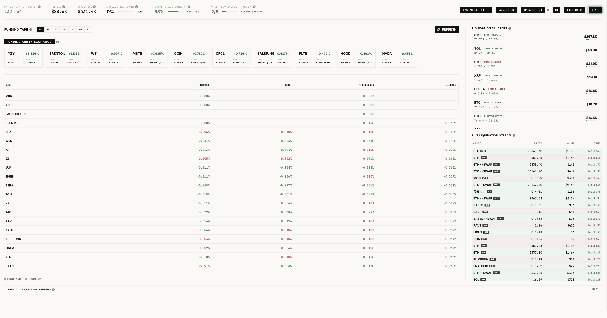

# Crypto Liquidation Feed

Browser-based dashboard for live liquidations, funding rates, clustering, replay, and anomaly tracking.

## Live Website
[View Live Website](https://cryptoliqfeed.netlify.app)



## What It Is

This project tracks live liquidation activity across exchanges and pairs it with funding, clustering, replay, and anomaly tools. Everything runs in the browser.

## Features
- Live liquidation stream for perpetual markets
- Exchange selection across Binance, Bybit, and OKX
- Client-side market stress meters for cascade risk, chaos, and anomaly
- Funding rates and cross-exchange funding spread view
- Replay controls with play, pause, seek, speed, and compare-to-live support
- Replay dataset capture, import, export, and browser-side management
- Shared minute-vector pipeline for live scoring and offline model training
- Optional offline-trained TensorFlow.js autoencoder scoring in the browser
- Responsive dashboard with audio alerts and inline help for market jargon

## Supported Exchanges
- Binance
- Bybit
- OKX

## Installation

```bash
git clone https://github.com/Mohamed1756/Crypto-Liquidation-Feed/
cd Crypto-Liquidation-Feed
npm install
npm run dev
```

## Production Build

```bash
npm run build
```

## Replay And ML Workflow

The replay pipeline is built around full timestamps and canonical minute vectors.

1. Capture raw liquidation events into JSONL:

```bash
npm run replay:capture
```

2. Build a replay dataset with dated timestamps and minute vectors:

```bash
npm run replay:build -- --input=./data/captures/binance-2025-01-01.jsonl
```

For legacy CSV files with time-only rows, pass an assumed date:

```bash
npm run replay:build -- --input=./my-file.csv --assume-date=2025-01-01
```

3. Train a small offline autoencoder and emit a browser-loadable manifest:

```bash
npm run replay:train -- --input=./public/replay/liquidation-replay-dataset.json
```

By default the trained model is written to `public/ml/liquidation-autoencoder.json`, which the app can load at runtime.

Inside the app, imported datasets can be replayed locally with:

- play and pause controls
- minute-by-minute seek
- adjustable playback speed
- compare-to-live matching
- replay-driven stream, cluster, and canvas views

## Notes

- The browser anomaly meter works without a shipped model by using the rolling statistical baseline.
- Shipping an offline-trained model improves regime recognition, but the replay dataset quality matters more than model complexity.
- Live ingestion, replay, and analytics all run client-side.

